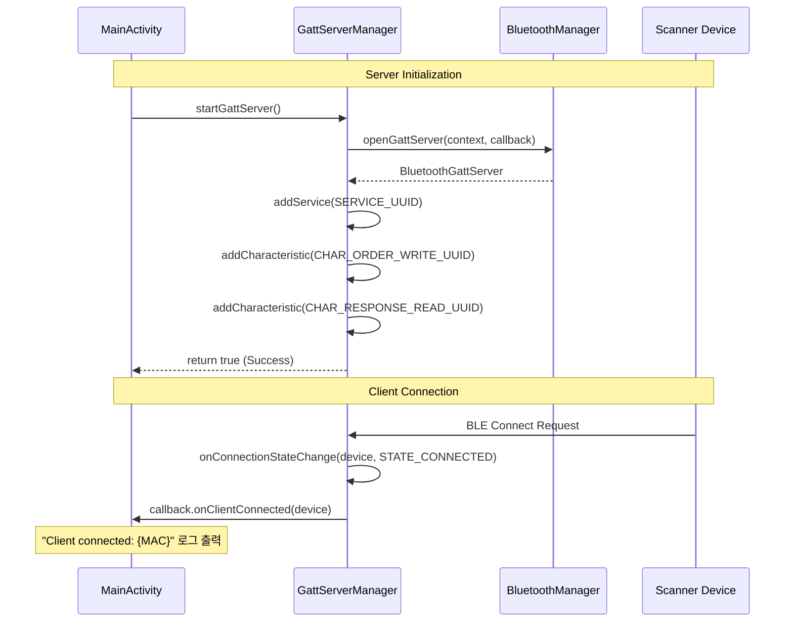
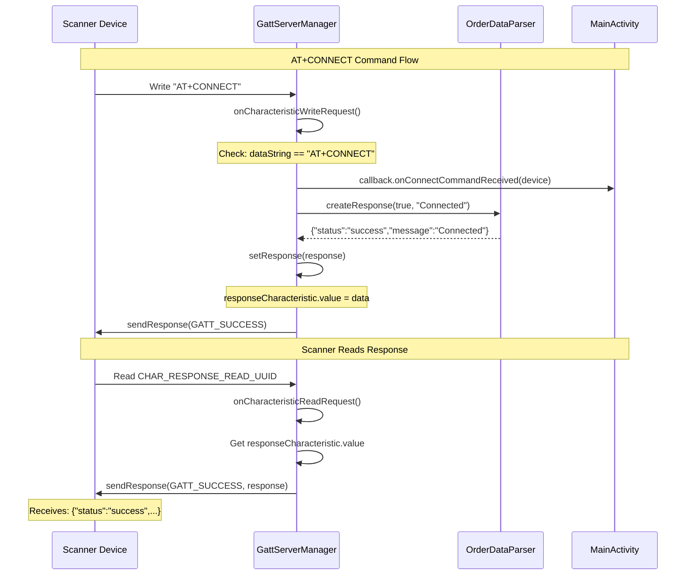
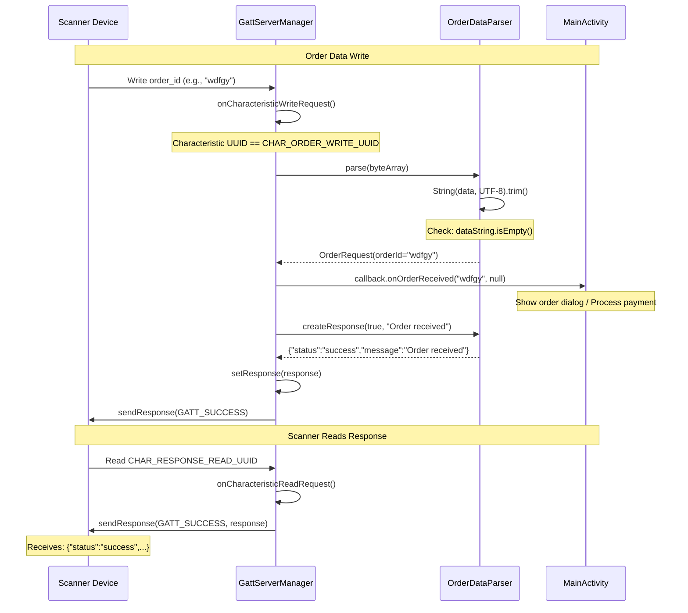
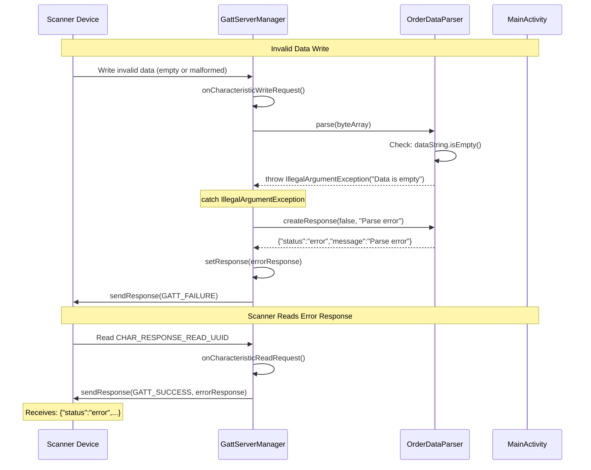
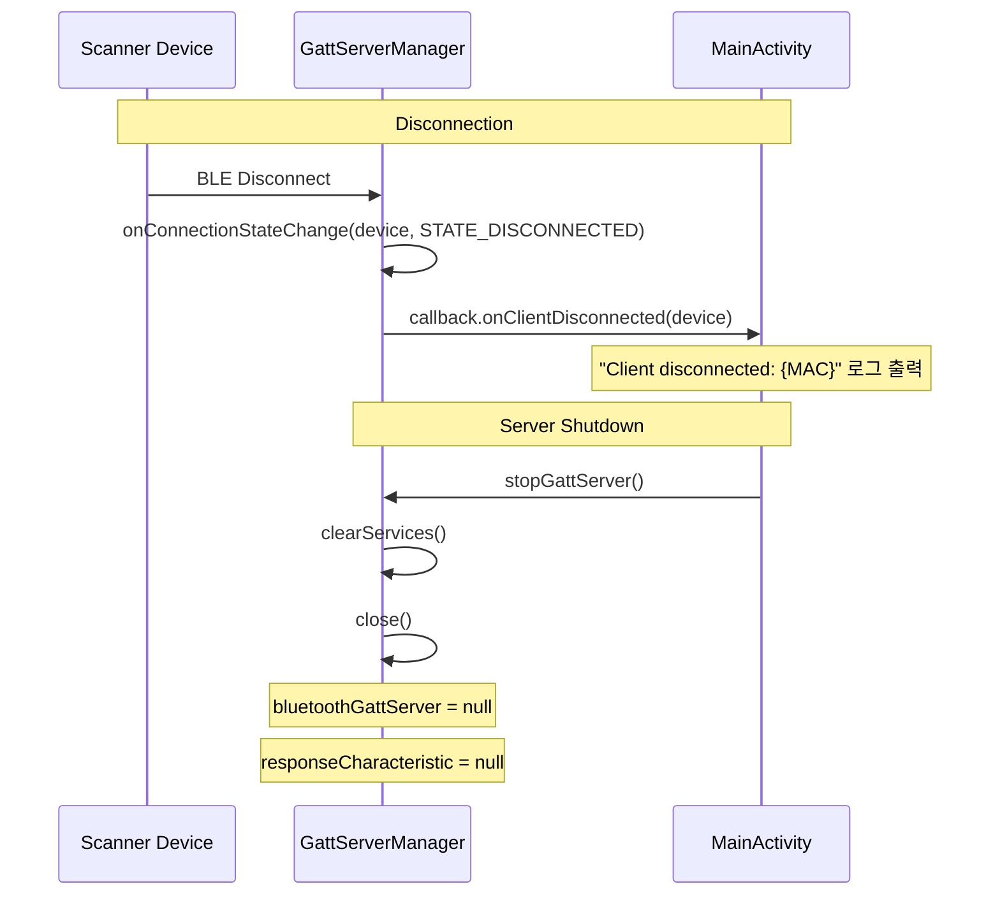

# GATT Server - Scanner 통신 Sequence Diagram

## 개요
이 문서는 외부 Scanner (BLE Client)와 Store App (GATT Server) 간의 통신 흐름을 함수명과 함께 설명합니다.

## Architecture Overview

```
Scanner (BLE Client)  ←→  Store App (GATT Server)
    |                           |
    |                      GattServerManager
    |                      OrderDataParser
```

## Sequence Diagrams

### 1. GATT Server 시작 및 연결 프로세스



**관련 함수:**
- `GattServerManager.startGattServer()` (line 68-121)
- `gattServerCallback.onConnectionStateChange()` (line 148-167)
- `GattServerCallback.onClientConnected()` (line 48)

---

### 2. AT+CONNECT 명령어 처리 프로세스



**관련 함수:**
- `gattServerCallback.onCharacteristicWriteRequest()` (line 169-263)
  - Line 186-206: AT+CONNECT 처리
- `OrderDataParser.createResponse()` (line 52-55)
- `GattServerManager.setResponse()` (line 141-144)
- `gattServerCallback.onCharacteristicReadRequest()` (line 265-298)

---

### 3. Order 데이터 전송 프로세스



**관련 함수:**
- `gattServerCallback.onCharacteristicWriteRequest()` (line 169-263)
  - Line 210-230: Order 데이터 처리
- `OrderDataParser.parse()` (line 28-43)
- `GattServerCallback.onOrderReceived()` (line 43)
- `OrderDataParser.createResponse()` (line 52-55)
- `gattServerCallback.onCharacteristicReadRequest()` (line 265-298)

---

### 4. 에러 처리 프로세스



**관련 함수:**
- `gattServerCallback.onCharacteristicWriteRequest()` (line 169-263)
  - Line 231-246: 에러 처리
- `OrderDataParser.parse()` (line 28-43)
  - Line 32-34: IllegalArgumentException throw
- `OrderDataParser.createResponse()` (line 52-55)

---

### 5. 연결 해제 프로세스



**관련 함수:**
- `gattServerCallback.onConnectionStateChange()` (line 148-167)
- `GattServerCallback.onClientDisconnected()` (line 53)
- `GattServerManager.stopGattServer()` (line 126-136)

---

## 함수 호출 흐름 요약

### Write → Response 전체 흐름

```
1. Scanner writes data
   ↓
2. onCharacteristicWriteRequest() [line 169]
   ↓
3-1. AT+CONNECT 분기 [line 186-206]
     → callback.onConnectCommandReceived()
     → createResponse(true, "Connected")
     → setResponse()
     → sendResponse(GATT_SUCCESS)

3-2. Order data 분기 [line 210-230]
     → OrderDataParser.parse()
     → callback.onOrderReceived()
     → createResponse(true, "Order received")
     → setResponse()
     → sendResponse(GATT_SUCCESS)

3-3. Error 분기 [line 231-246]
     → catch IllegalArgumentException
     → createResponse(false, error_message)
     → setResponse()
     → sendResponse(GATT_FAILURE)
   ↓
4. Scanner reads response
   ↓
5. onCharacteristicReadRequest() [line 265]
   ↓
6. Get responseCharacteristic.value [line 275]
   ↓
7. sendResponse(GATT_SUCCESS, response) [line 278]
```

---

## GATT Service Configuration

### Service UUID 및 Characteristic UUID

**파일:** `GattServiceConfig.kt`

```kotlin
// Service
SERVICE_UUID: "00001800-0000-1000-8000-00805f9b34fb"

// Characteristics
CHAR_ORDER_WRITE_UUID: "00002a00-0000-1000-8000-00805f9b34fb"  // Scanner → Store
CHAR_RESPONSE_READ_UUID: "00002a01-0000-1000-8000-00805f9b34fb"  // Store → Scanner

// Properties
PROPERTY_WRITE: BluetoothGattCharacteristic.PROPERTY_WRITE
PROPERTY_READ: BluetoothGattCharacteristic.PROPERTY_READ

// Permissions
PERMISSION_WRITE: BluetoothGattCharacteristic.PERMISSION_WRITE
PERMISSION_READ: BluetoothGattCharacteristic.PERMISSION_READ
```

---

## Response 데이터 형식

### 성공 응답
```json
{
  "status": "success",
  "message": "Order received"
}
```

### 에러 응답
```json
{
  "status": "error",
  "message": "Parse error"
}
```

**생성 함수:** `OrderDataParser.createResponse()` (line 52-55)

---

## 로그 메시지 가이드

### 정상 흐름
```
D/GattServerManager: GATT Server started successfully
D/GattServerManager: Client connected: XX:XX:XX:XX:XX:XX
D/GattServerManager: Write request from XX:XX:XX:XX:XX:XX
D/GattServerManager: AT+CONNECT command received  OR  Order parsed - ID: wdfgy
D/GattServerManager: Response data set: {"status":"success",...}
D/GattServerManager: Read request from XX:XX:XX:XX:XX:XX
D/GattServerManager: Response sent: {"status":"success",...}
```

### 에러 흐름
```
E/GattServerManager: Failed to parse order data
D/OrderDataParser: Data is empty
D/GattServerManager: Response data set: {"status":"error",...}
```

---

## Scanner 측 구현 가이드

Scanner (BLE Client)에서 이 GATT Server와 통신하려면:

### 1. 연결
```kotlin
bluetoothGatt = device.connectGatt(context, false, gattCallback)
```

### 2. Service Discovery
```kotlin
bluetoothGatt.discoverServices()
// onServicesDiscovered() 콜백에서:
val service = bluetoothGatt.getService(SERVICE_UUID)
val writeChar = service.getCharacteristic(CHAR_ORDER_WRITE_UUID)
val readChar = service.getCharacteristic(CHAR_RESPONSE_READ_UUID)
```

### 3. AT+CONNECT 전송
```kotlin
writeChar.value = "AT+CONNECT".toByteArray()
bluetoothGatt.writeCharacteristic(writeChar)
```

### 4. Response 읽기
```kotlin
bluetoothGatt.readCharacteristic(readChar)
// onCharacteristicRead() 콜백에서:
val response = String(characteristic.value)  // {"status":"success",...}
```

### 5. Order 데이터 전송
```kotlin
writeChar.value = "wdfgy".toByteArray()
bluetoothGatt.writeCharacteristic(writeChar)
// 이후 다시 readChar로 응답 읽기
```

---

## 참고 파일
- `GattServerManager.kt` - GATT 서버 메인 로직
- `OrderDataParser.kt` - 데이터 파싱 및 응답 생성
- `GattServiceConfig.kt` - UUID 및 설정 정의
- `MainActivity.kt` - 콜백 처리 및 UI 업데이트
